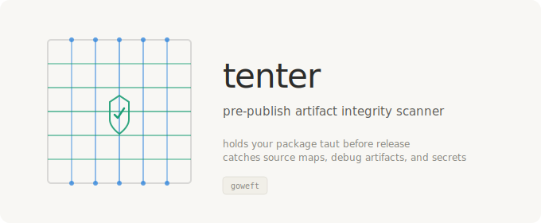

<p align="center"></p>

# Tenter

Pre-publish artifact integrity scanner. Detects source maps, debug artifacts, secrets, and sensitive files before they ship in your package.

**Born from the Claude Code npm source map leak (March 31, 2026)** — where a single missing `.npmignore` entry shipped 512,000 lines of proprietary source code to the public npm registry via a 59.8 MB source map file.

## Why This Exists

On March 31, 2026, Anthropic accidentally published Claude Code's entire TypeScript source via an included `.map` file in npm package version 2.1.88. Within hours, the code was mirrored across 82,000+ GitHub forks, internal model codenames were exposed, and attackers launched supply chain attacks using typosquatted package names targeting developers trying to build from the leaked source.

The root cause was preventable: **no automated check validated the package contents before publish.**

Existing tools scan for known CVEs and secrets in source repos. None inspect the **final published artifact** for debug files, source maps, oversized anomalies, or internal development artifacts that should never ship. `tenter` fills that gap.

## Quick Start

```bash
# Install
pip install tenter

# Scan a directory before publish
tenter scan ./dist

# Scan an npm tarball
tenter scan my-package-1.0.0.tgz

# Use npm pack --dry-run integration
tenter npm-check .

# Scan a Python wheel
tenter scan my_package-0.1.0-py3-none-any.whl

# JSON output for CI
tenter scan ./dist --format json

# SARIF output for GitHub/GitLab code scanning
tenter scan ./dist --format sarif > results.sarif
```

## See It Work

<p align="center"></p>

## What It Catches

| Rule ID | Severity | What |
|---------|----------|------|
| **MAP-001** | CRITICAL | Source map files (`.map`, `.js.map`, `.css.map`, etc.) |
| **MAP-002** | CRITICAL/HIGH | `sourceMappingURL` references in JS/CSS (external URLs = CRITICAL) |
| **DBG-001** | HIGH | Debug symbols (`.pdb`, `.dSYM`, `.debug`, `src.zip`) |
| **SEC-001** | CRITICAL | Sensitive files (`.env`, `.npmrc`, `.pypirc`, private keys, credentials) |
| **SEC-002** | CRITICAL | Embedded secrets (AWS keys, GitHub tokens, API keys, private keys) |
| **INT-001** | MEDIUM | Internal artifacts (`.claude/`, `CLAUDE.md`, `.cursor/`, `coverage/`, `__pycache__/`) |
| **SIZE-001** | CRITICAL | Anomalously large files (>50 MB — the Claude Code map was 59.8 MB) |
| **SIZE-002** | MEDIUM | Large files (>10 MB) |
| **SIZE-003** | HIGH | Total package size exceeds threshold (>200 MB) |

### Secret Patterns Detected

AWS access keys and secrets, GitHub PATs (classic and fine-grained), GitHub OAuth tokens, OpenAI API keys, Anthropic API keys, Slack tokens, npm tokens, PyPI tokens, private keys (RSA/EC/DSA/OpenSSH), hardcoded passwords, hardcoded API keys, and Bearer tokens.

## CI Integration

### GitHub Actions

```yaml
name: Publish Guard
on:
  push:
    branches: [main]
  pull_request:

jobs:
  scan:
    runs-on: ubuntu-latest
    steps:
      - uses: actions/checkout@v4

      - uses: actions/setup-python@v5
        with:
          python-version: "3.12"

      - name: Install tenter
        run: pip install tenter

      - name: Scan package
        run: tenter scan . --format sarif > tenter.sarif

      - name: Upload SARIF
        if: always()
        uses: github/codeql-action/upload-sarif@v3
        with:
          sarif_file: tenter.sarif
```

### npm prepublishOnly Hook

```json
{
  "scripts": {
    "prepublishOnly": "tenter scan . --fail-on high"
  }
}
```

### GitLab CI

```yaml
tenter:
  stage: test
  image: python:3.12-slim
  script:
    - pip install tenter
    - tenter scan . --format json --fail-on high
  artifacts:
    reports:
      sast: tenter.sarif
    when: always
```

## Configuration

Create a `.tenter.json` in your project root:

```bash
tenter init
```

Default configuration:

```json
{
  "allowlist": [],
  "size_limit_single_file_bytes": 52428800,
  "size_limit_total_bytes": 209715200,
  "extra_sensitive_patterns": [],
  "extra_debug_patterns": []
}
```

### Allowlisting Files

If a detected file is intentional (e.g., you ship source maps for debugging in an open-source project):

```json
{
  "allowlist": [
    "dist/*.map",
    "vendor/large-asset.bin"
  ]
}
```

## Supported Package Types

| Type | Input | Detection |
|------|-------|-----------|
| **npm** | `.tgz` tarball, directory with `package.json`, `npm pack --dry-run` | Auto |
| **pip** | `.tar.gz` sdist, `.whl` wheel, directory with `pyproject.toml`/`setup.py` | Auto |
| **cargo** | `.crate` file, directory with `Cargo.toml` | Auto |
| **generic** | Any directory | Fallback |

## Exit Codes

| Code | Meaning |
|------|---------|
| 0 | No findings at or above the `--fail-on` threshold |
| 2 | Findings at or above the `--fail-on` threshold — **do not publish** |

The `--fail-on` flag controls the minimum severity that causes a non-zero exit:

```bash
# Only fail on CRITICAL (most permissive)
tenter scan . --fail-on critical

# Fail on HIGH or above (default)
tenter scan . --fail-on high

# Fail on anything including INFO (strictest)
tenter scan . --fail-on info
```

## Zero Dependencies

`tenter` uses only Python standard library modules. No `requests`, no `click`, no `pydantic` — nothing that could itself be a supply chain vector. A security tool that can be supply-chain attacked is not a security tool.

## How It Would Have Caught the Claude Code Leak

Running `tenter scan` on Claude Code v2.1.88 before publish would have produced:

```
═══ tenter scan results ═══
  Package type: npm
  Path: @anthropic-ai/claude-code-2.1.88.tgz
  Files: 12
  Size: 62,451.2 KB (61.00 MB)

  ┌─ CRITICAL (2)
  │ ✖ [MAP-001] dist/cli.js.map
  │   Source map file detected in package
  │   Source maps expose original source code. This is the exact
  │   vulnerability class that leaked Claude Code's 512K-line codebase.
  │ ✖ [SIZE-001] dist/cli.js.map
  │   Anomalously large file: 59.8 MB
  │   Exceeds 50 MB threshold. The Claude Code source map that leaked was 59.8 MB.
  └────────────────────────────────────────────────────────

  ┌─ HIGH (1)
  │ ✖ [MAP-002] dist/cli.js
  │   sourceMappingURL reference found
  │   Points to: https://r2.anthropic.com/.../src.zip
  └────────────────────────────────────────────────────────

  ✖ BLOCKED: 3 finding(s) — 2 critical, 1 high. DO NOT PUBLISH.
```

## Also by goweft

- **[heddle](https://github.com/goweft/heddle)** — Policy-and-trust layer for MCP tool servers
- **[unshear](https://github.com/goweft/unshear)** — AI agent fork divergence detector

## License

MIT — see [LICENSE](LICENSE).

## Contributing

Issues and PRs welcome at [github.com/goweft/tenter](https://github.com/goweft/tenter).

If this tool prevents even one accidental leak, it was worth building.
